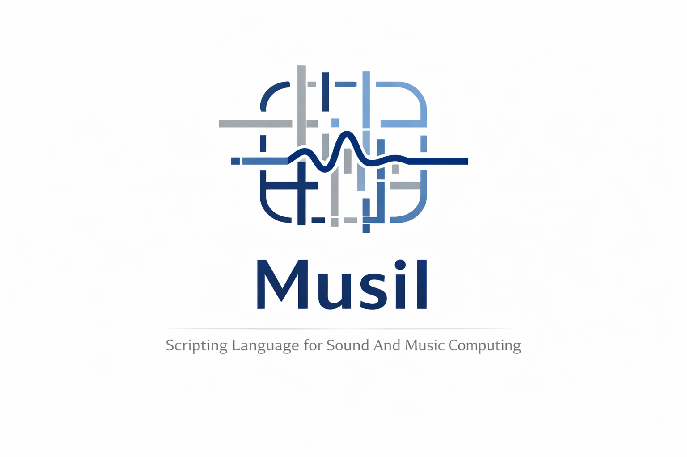

# Musil



**Musil** is a tiny and expressive language designed to be easy to use, easy to expand and easy to embed in host applications.

It comes as a command-line interpreter (`musil`) and as **Musil**, the Listener: a window where you type Musil, drop files to run them (they re-run when you save), see your variables, and where plots appear and sound plays.

The core of the language is made of a single [C++ header](src/core.h) and a more or less comprehensive overview of the language can be found [here](examples/reference.mu).

## Lineage

*Musil* sits within a family of small, expressive languages, combining influences from both scripting and functional traditions.

It is strongly inspired by TCL, Lisp and Scheme. From these traditions, **Musil** inherits:

- first-class procedures
- dynamic evaluation mechanisms such as `eval` and `apply`  
- homoiconicity 

These influences shape **Musil** as a language where programs can be constructed, transformed, and executed as data — enabling flexible and expressive workflows.

```
# musil
function fact (n) {
    if (< n 2) { return 1 }
    return (* n (fact (- n 1)))
}
print "10! =" (fact 10)

var v (range 8)
print "v * v + 1 =" (expr (v * v + 1))
print "squares of evens:" (map (filter v (function (x) (== (mod x 2) 0))) (function (x) (* x x)))
```
# Why the name *Musil*?

The language is named after **Robert Musil**, the Austrian engineer-philosopher-novelist who believed that authentic creativity emerges from the interplay of **rational precision** and **subjective intuition**.

In *The Man Without Qualities*, Musil describes the human condition as a fusion of:

> *“Präzision und Seele”*  
> *precision and soul*

This duality mirrors the purpose of the Musil language:

- a core of **exact signal operations**,  
- expressed in a syntax designed for **open exploration**,  
- allowing composition as a form of thought.

To call this language **Musil** is to acknowledge an intellectual lineage where  
mathematics, sound, and imagination are not separate disciplines but different faces of the same creative activity.

## Build and install

```sh
git clone https://github.com/CarmineCella/musil.git
cd musil
cmake -B build -DCMAKE_BUILD_TYPE=Release
cmake --build build
./build/musil examples/reference.mu     # tour of the core language
MUSIL_PATH=src ./build/musil examples/reference_std.mu    # ... and of the standard library
./build/musil                           # REPL
ctest --test-dir build                  # run the tests
cmake --install build                   # musil -> /usr/local/bin, *.mu -> ~/.musil
cmake --build build --target musil-uninstall  # removes exactly what install put in place
./build/musil-listener                  # the Listener (needs a display)
./deploy_macos.sh                       # macOS: dist/Musil.app (universal), dist/musil, dist/lib, a zip
```

The build fetches raylib 5.5 (the only dependency) for the plot library and the
Listener; `-DMUSIL_RAYLIB=OFF` builds the language and the four other libraries
with no dependency at all. On macOS the raylib build needs Xcode's command-line
tools; on Linux the X11 and OpenGL development headers.

`cmake --install build --prefix ~/.local` installs the binary under your home
instead. Nothing is loaded automatically: a program that wants the Musil halves
of the libraries says `load "std.mu"` (or `load "system.mu"`, which loads
std.mu itself), and `load` finds them in `~/.musil`, in `MUSIL_PATH`, or next
to the file doing the loading. During development, `MUSIL_PATH=src` points at
the source tree; the test suite sets it for you. GNU readline is used in the REPL when found (`-DMUSIL_READLINE=OFF`
to disable).

## Layout

```
src/core.h         the language: reader, evaluator, value model, primitive builtins (zero dependencies)
src/std.h          the standard library, C++ half: range, sort, strings, files, map/filter/reduce, assert
src/std.mu         the standard library, Musil half: zeros, linspace, mean, last, take, zip, compose, ...
src/system.h       operating-system access, C++ half: exec, ls, stat, CSV, WAV, UDP/OSC
src/system.mu      operating-system access, Musil half: file-lines, basename, wav-duration, ...
src/system/        WAV and CSV readers used by system.h
src/scientific.h   linear algebra and machine learning, C++ half: mat-mul, transpose, det/inv/solve, eig-sym, kmeans, knn
src/scientific.mu  Musil half: construction, elementwise ops, statistics, cov/corr/pca, regression, bpf, model helpers
src/scientific/    the algorithms used by scientific.h (k-means, KNN, running median)
src/signals.h      offline signal processing, C++ half: fft, ifft, osc, iir, delay, resample, autocorr, gather, local-maxima
src/signals.mu     Musil half: generators, windows, spectra, stft, cepstral envelopes, phase vocoder, features, filters
src/plot.h         plotting, C++ half (raylib): renders a figure to a window or a PNG
src/plot.mu        Musil half: figures, layers (line, scatter, bars, image, surface), waveform, spectrogram, ...
listener/          the Listener: main.cpp and the font asset
src/musil.h        umbrella header: make_env registers the C++ halves, load_prelude loads the Musil halves
cli/main.cpp       the command-line interpreter: musil [-i] [-e code] a.mu b.mu ... [-- args]
examples/          one reference per library (core, std, system, scientific, signals, plot)
                   and short programs, one per topic; every example runs as a test
tests/             one test per library (test_core, test_std, test_system) on a shared harness
                   (test.mu: check, fails?, error-of, report), plus stress, smoke, load tests
                   and the golden outputs of the references
```

A library is a pair: `<name>.h` for what needs C++ and `<name>.mu` for what can be
written in Musil. The rule for choosing: an element-by-element loop runs about a
hundred times faster in C++, so it goes in the `.h`; anything that composes vector
operations (`(pow (sum (pow (abs v) p)) (/ 1 p))` is `lp-norm`) runs at C++ speed
in Musil already, so it goes in the `.mu`. Operating-system access is C++ by
necessity.
The `.h` exposes `add_<name>(Interp&)` and is registered by `make_env`; the
`.mu` is loaded explicitly by the program, through the normal `load` search
path (`~/.musil` after `cmake --install`, `MUSIL_PATH`, or next to the file).

## Documentation

`(help name)` prints the signature and description of any builtin or library function.
`docs/musil_manual.pdf` is the user manual. Both come from the same place: the comment
above each function in `src/` (`// (name args) description` in a `.h`, `# (name args)
description` in a `.mu`). `python3 tools/gendoc.py` (or `cmake --build build --target
musil-docs`) regenerates `src/help.txt` and `docs/generated/*.tex`, and the manual
includes those, so documenting a function is writing its comment.

## The language in one page

```
var x 10                       # define in the current environment (a function's var is always local)
set x 11                       # assign to an existing variable, however far out; error if none
print "x =" x                  # a line is a command; its words are the arguments
var y (+ x 1)                  # (...) is a sub-expression
var z (expr (x * 2 + y))       # infix inside expr; ( ) groups, calls are allowed: (expr ((sqrt x) + 1))

if (< x y) { print "less" } { print "not less" }
while (< x 20) { var x (+ x 1) }
{ var a 1; var b 2 }           # ; separates commands on one line
for (var i 0) (< i 3) (var i (+ i 1)) { print i }      # break / continue inside blocks: { break }

function sq (n) (* n n)        # named function, one-expression body
function fact (n) {            # block body; return exits early
    if (< n 2) { return 1 }
    return (* n (fact (- n 1)))
}
var inc (function (n) (+ n 1)) # anonymous function
function add3 (a b c) (+ a b c)
var add1 (add3 1)              # too few args: partial application
(add1 2 3)                     # => 6
(add3 1 2 3 4)                 # too many args: the result is applied to the rest (error here: 6 is not callable)

var v (vec 1 2 3)              # numbers are vectors; scalars are vectors of size 1
(+ v 10)                       # broadcasting: (11 12 13)
(sin v)                        # elementwise
(getidx v -1)                  # indices count from the end when negative
(slice (range 10) 2 3)         # (2 3 4)

var L (list 1 "two" 'three)    # lists hold anything; 'x quotes a symbol or form
(map L str) (filter v (function (n) (> n 1))) (reduce v + 0)
(head L) (tail L) (last L) (length L) (push L 4) (pop L)
var M (copy L)                 # copy is shallow: a new list, same elements (nested lists/vectors stay shared)

load "std.mu"                  # the Musil half of the standard library, from ~/.musil or MUSIL_PATH
(take (range 10) 3) (fmt-fixed pi 4) (lerp 0 10 0.5) (stdev (vec 1 2 3 4))

var code '(+ 1 2)              # code is data
(eval code)                    # => 3
(apply + (list 1 2 3))         # => 6

try (error "boom") catch e (print "caught:" e)
assert (== (+ 2 2) 4) "arithmetic works"
```

Errors carry the file, the line and the call stack:

```
reference.mu:424: from inner
  1> inner() at reference.mu:426
  2> outer() at reference.mu:429
```

Tail calls run in constant space, so `loop`-style recursion is the normal way to iterate.

## Embedding

```cpp
#include "musil.h"
musil::Interp I;
musil::make_env(I);      // C++ halves of std and system; omit for the bare language
// name, function, min args, max args (-1 = unbounded); eval checks the count
I.def("hello", [](musil::vlist& a, musil::Interp& i) -> musil::vptr {
    return musil::v_str("hello, " + i.str(a[0]));
}, 1, 1);
I.run("print (hello \"world\")");
```

Inside a builtin, `i.num(v)`, `i.scalar(v)`, `i.index(v)`, `i.str(v)`,
`i.list(v)` and `i.fn(v)` return the payload or raise a Musil error that names
the builtin, with file and line (`hello: expected string, got number`);
`i.bad("message")` raises one with a custom text. `Interp::call_fn` calls a
Musil function from C++. `Interp::yield_fn` is called every 1024 evaluations,
for hosts that need to service an event loop.

For an example on how to integrate the language in your application, please check the [command line interpreter](cli/main.cpp).

# License

The **Musil** language is released under the [BSD 2-Clause license](LICENSE.md).

(c) 2026 by Carmine-Emanuele Cella
